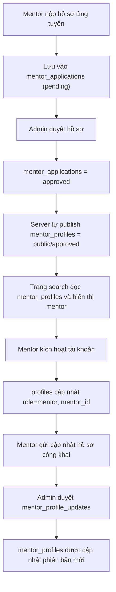

# Mentor Approval Flow Review

## 1. Mục tiêu báo cáo

Phần này tập trung vào một luồng quan trọng của sản phẩm:

- Admin duyệt hồ sơ mentor
- Mentor được đồng bộ lên trang tìm kiếm
- Mentor kích hoạt tài khoản và tiếp tục hoàn thiện hồ sơ

Mục tiêu của bản cập nhật là đảm bảo:

- Trạng thái duyệt và trạng thái hiển thị không bị lệch nhau
- Mentor đã được duyệt có thể xuất hiện đúng trên trang tìm kiếm
- Hệ thống vận hành ổn định hơn khi đi qua nhiều bước: apply, approve, activate, update profile

## 2. Vấn đề gốc đã phát hiện

Lỗi không nằm ở giao diện tìm kiếm, mà nằm ở chỗ luồng nghiệp vụ chưa khép kín.

Trước khi sửa:

- Admin duyệt hồ sơ trong `mentor_applications`
- Trang tìm kiếm lại lấy dữ liệu từ `mentor_profiles`
- Khi admin chuyển trạng thái sang `approved`, hệ thống chưa tự tạo hoặc cập nhật profile public tương ứng

Kết quả:

- Mentor nhìn như đã được duyệt
- Nhưng không xuất hiện trên trang tìm kiếm
- Dẫn đến lệch trạng thái giữa vận hành nội bộ và trải nghiệm người dùng

## 3. Nguyên nhân hệ thống

Nguyên nhân gốc là có nhiều lớp dữ liệu nhưng chưa có quy tắc đồng bộ rõ ràng:

- `mentor_applications`: hồ sơ ứng tuyển ban đầu
- `mentor_profiles`: hồ sơ public dùng cho tìm kiếm và hiển thị
- `mentor_profile_updates`: các lần mentor gửi cập nhật hồ sơ công khai
- `profiles`: thông tin tài khoản người dùng

Vấn đề trước đây là hệ thống thiếu bước:

`approved application -> publish public mentor profile`

## 4. Giải pháp đã triển khai

Đã bổ sung lại luồng theo hướng backend là nguồn đảm bảo chính:

1. Khi admin duyệt `mentor_applications` sang `approved`, server tự động tạo hoặc cập nhật `mentor_profiles`.
2. Hồ sơ được đưa sang trạng thái public để trang tìm kiếm có thể lấy ra ngay.
3. Khi mentor kích hoạt tài khoản, hệ thống giữ lại profile public đã được publish trước đó, không làm hồ sơ rơi ngược về `draft`.
4. Khi tải danh sách mentor public, hệ thống có thêm cơ chế repair cho dữ liệu cũ đã được approve nhưng chưa kịp publish.

## 5. Lợi ích sau cập nhật

- Mentor đã được admin duyệt sẽ lên trang tìm kiếm ngay
- Giảm thao tác thủ công giữa team vận hành và team sản phẩm
- Giảm rủi ro lệch trạng thái giữa backend và frontend
- Tạo nền tốt hơn để tiếp tục mở rộng quy trình duyệt mentor

## 6. Luồng nghiệp vụ sau khi chuẩn hóa

## 7. Cách kiểm thử với lãnh đạo

Khi trình bày, nên demo theo đúng hành trình người dùng:

1. Tạo hoặc chọn một hồ sơ mentor đang ở trạng thái `pending`
2. Vào màn admin và chuyển sang `approved`
3. Mở trang tìm kiếm và xác nhận mentor đã xuất hiện
4. Mở chi tiết mentor để xác nhận dữ liệu đã đọc được từ profile public
5. Kích hoạt tài khoản mentor
6. Đăng nhập mentor và chỉnh sửa hồ sơ công khai
7. Duyệt bản cập nhật mới từ admin
8. Quay lại tìm kiếm và xác nhận dữ liệu đã thay đổi đúng

## 8. Điểm cần nói rõ với lãnh đạo

Nên trình bày ngắn gọn theo cấu trúc sau:

- Vấn đề: quy trình duyệt và quy trình hiển thị search chưa được nối chặt với nhau
- Tác động: mentor đã duyệt nhưng không xuất hiện trên search, gây sai lệch vận hành
- Cách xử lý: chuẩn hóa đồng bộ backend giữa application và public profile
- Kết quả: khi duyệt xong, mentor được đưa lên search ngay và không bị mất trạng thái khi activate
- Hướng tiếp theo: bổ sung test regression và audit log để phòng lỗi lặp lại

## 9. Rủi ro còn lại và đề xuất tiếp theo

Các điểm nên tiếp tục làm sau buổi báo cáo:

- Viết test tự động cho luồng admin approve -> mentor xuất hiện trên search
- Bổ sung audit log cho hành động duyệt của admin
- Chuẩn hóa state machine cho mentor để tránh mỗi màn hình hiểu trạng thái theo một cách
- Tách bớt logic nghiệp vụ khỏi frontend để backend đảm bảo tính nhất quán

## 10. Kết luận

Đây là một bản sửa quan trọng về luồng nghiệp vụ, không chỉ là sửa giao diện.

Điểm cải thiện chính là:

- hệ thống đã đồng bộ đúng giữa duyệt nội bộ và hiển thị bên ngoài
- trải nghiệm người dùng nhất quán hơn
- team vận hành dễ kiểm soát hơn
- có nền tảng tốt hơn để tiếp tục mở rộng phần quản lý mentor
